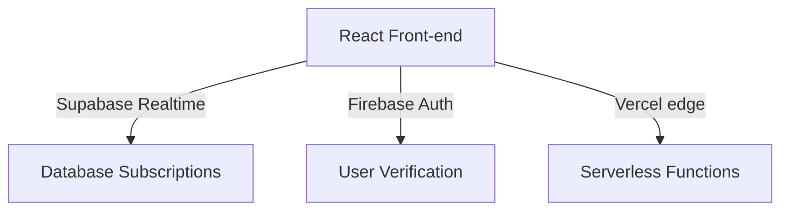

# ⚡ KCT PULSE — Real-time Classroom Engagement

<div align="center">

[](https://kct-classroom-flow.vercel.app)
[](https://supabase.com)
[](https://firebase.google.com)
[](https://kct.ac.in)

**Transforming KCT classrooms into active, interactive learning environments.** 

[Explore Live Web App 🚀](https://kct-classroom-flow.vercel.app) • [Faculty Portal 🔑](https://kct-classroom-flow.vercel.app/auth)

---


</div>

---

### ✨ Core Features

*   📊 **Instant Audience Polls** — Launch multi-choice polls with live, animating bar charts.
*   ☁️ **Real-time Word Clouds** — Watch student inputs dynamically form interactive, sizing word clusters.
*   ⚡ **Instant Student Access** — No signups, no logins. Students join in seconds using a auto-generated QR code or short session pin.
*   🔒 **Secure Faculty Control** — Simple sign-in portal via Google, Microsoft, or college credentials powered by Firebase Auth.

---

### 🛠️ Architecture & Tech Stack

Our platform is engineered for high performance, sub-second latency, and scale.



*   **Framework:** React 19 + [Vite](https://vite.dev) + [TanStack Router & Start](https://tanstack.com/router)
*   **Database & Subscriptions:** [Supabase](https://supabase.com) (PostgreSQL + Realtime Channel Engines)
*   **Authentication:** [Firebase Authentication](https://firebase.google.com) (Faculty accounts, Google & Microsoft OAuth)
*   **Styling & Components:** Tailwind CSS + Radix UI + Lucide Icons
*   **Hosting:** [Vercel](https://vercel.com) (Edge Network)

---

### 🚀 Getting Started

#### 1. Clone the repository
```bash
git clone https://github.com/navneethvaradharaj11-dev/kct-classroom-flow.git
cd kct-classroom-flow
```

#### 2. Install dependencies
```bash
npm install
```

#### 3. Setup Environment Variables
Create a `.env` file in the root directory:
```env
SUPABASE_URL="your-supabase-url"
SUPABASE_PUBLISHABLE_KEY="your-supabase-key"
VITE_FIREBASE_API_KEY="your-firebase-key"
VITE_FIREBASE_AUTH_DOMAIN="your-auth-domain"
VITE_FIREBASE_PROJECT_ID="your-project-id"
VITE_FIREBASE_STORAGE_BUCKET="your-storage-bucket"
VITE_FIREBASE_MESSAGING_SENDER_ID="your-sender-id"
VITE_FIREBASE_APP_ID="your-app-id"
```

#### 4. Run Dev Server
```bash
npm run dev
```
Open [http://localhost:8080](http://localhost:8080) to test the app locally.

---

### 👨‍💻 Contributors

This project is built and maintained with ⚡ by:

*   **Navneeth Varadharaj** — [@navneethvaradharaj11-dev](https://github.com/navneethvaradharaj11-dev)
*   **Tharun** — [@Tharunmtb-racer21](https://github.com/Tharunmtb-racer21)

---

<div align="center">
Built for <b>Kumaraguru College of Technology</b>. Character is life.
</div>
