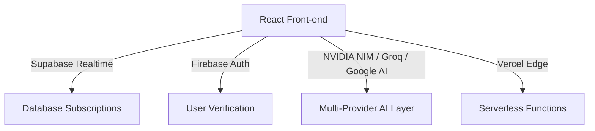

# ⚡ KCT PULSE — Enterprise Classroom Engagement & Telemetry

<div align="center">

[](https://kct-classroom-flow.vercel.app)
[](https://supabase.com)
[](https://firebase.google.com)
[](https://kct.ac.in)

**Transforming Kumaraguru College of Technology (KCT) classrooms into active, interactive learning environments.** 

[Explore Live Web App 🚀](https://kct-classroom-flow.vercel.app) • [Faculty Portal 🔑](https://kct-classroom-flow.vercel.app/auth) • [Developer Telemetry 📊](https://kct-classroom-flow.vercel.app/developer)

---


</div>

---

### ✨ Core Features & Platform Capabilities

*   📊 **Instant Audience Polls & Word Clouds** — Launch multi-choice polls with live, animating bar charts and interactive word clusters.
*   📺 **Slide Presentation Embed View (`/embed/$code`)** — Dedicated frameless presentation layout designed for embedding directly into **Google Slides** or **Microsoft PowerPoint** slides via `iframe`, complete with projector QR codes and real-time chart synchronization.
*   👨‍💻 **Developer Telemetry & Faculty Monitoring (`/developer`)** — Password-gated administration dashboard (`Pulse_2026`) featuring:
    *   **Faculty Creator Mapping**: Shows Faculty Full Name & Email for every session.
    *   **Student Join Tracking & List Modal**: Displays total joined students with a popup modal listing exact student names.
    *   **Status & Timeframe Filters**: Instant filter buttons for `ALL`, `🟢 Live`, `📝 Draft`, and `🏁 Ended` sessions, plus timeframes (`1D`, `7D`, `30D`, `ALL`).
    *   **System Diagnostics**: Latency ping (ms), Supabase WebSocket channel connection status, and Firebase Auth domain statistics (`@kct.ac.in`, `@kongu.edu`).
*   ⏱️ **Automated 1-Hour Session Management** — Background cleanup loop automatically demotes live sessions active for > 1 hour back to `draft` mode.
*   🔒 **Enterprise Security & Inactivity Guard** — Restricted exclusively to verified institutional emails (`@kct.ac.in` and `@kongu.edu`) with 30-minute faculty inactivity auto-logout.
*   🤖 **Multi-Provider AI Engine** — Automated failover question generator (**NVIDIA NIM (Primary)** → **Groq** → **Google AI Studio** → **Together AI**) ensuring 16,000+ free queries/day.
*   📈 **Rich PDF Analytical Reports** — Export post-session analytics with exact student responses formatted as PDF downloads.

---

### 📚 Documentation & Technical Handover

- 📄 [**Client Technical Specification & Handover Report (`CLIENT_HANDOVER_SPEC.md`)**](./CLIENT_HANDOVER_SPEC.md) — Complete enterprise technical specification prepared for college administration and stakeholders.
- 🏗️ [**Project Architecture Guide (`PROJECT_ARCHITECTURE.md`)**](./PROJECT_ARCHITECTURE.md) — Comprehensive guide covering routing, Supabase database schemas, and background timers.
- 🎨 [**UI/UX Design System & Tokens (`DESIGN_SYSTEM.md`)**](./DESIGN_SYSTEM.md) — Complete visual identity, color scale, glassmorphism specs, and typography guide.

---

### 🛠️ Architecture & Tech Stack


```mermaid
graph TD
    A[React Front-end] -->|Supabase Realtime| B[Database Subscriptions]
    A -->|Firebase Auth| C[User Verification]
    A -->|NVIDIA NIM / Groq / Google AI| D[Multi-Provider AI Layer]
    A -->|Vercel Edge| E[Serverless Functions]
```

*   **Framework:** React 18 + [Vite](https://vite.dev) + [TanStack Router & Start](https://tanstack.com/router)
*   **Database & Subscriptions:** [Supabase](https://supabase.com) (PostgreSQL + Realtime Channel Engines)
*   **Authentication:** [Firebase Authentication](https://firebase.google.com) (Faculty accounts restricted to `@kct.ac.in`)
*   **AI API Switching:** Dynamic runtime provider failover implementation (`src/lib/ai-service.ts`)
*   **Styling & Components:** Tailwind CSS + Radix UI + Lucide Icons
*   **Hosting:** [Vercel](https://vercel.com) (Edge Network)

---

### 🚀 Getting Started

#### 1. Clone the repository
```bash
git clone https://github.com/navneethvaradharaj11-dev/kct-classroom-flow.git
cd kct-classroom-flow
```

#### 2. Install dependencies
```bash
npm install
```

#### 3. Setup Environment Variables
Create a `.env` file in the root directory:
```env
SUPABASE_URL="your-supabase-url"
SUPABASE_PUBLISHABLE_KEY="your-supabase-key"
VITE_FIREBASE_API_KEY="your-firebase-key"
VITE_FIREBASE_AUTH_DOMAIN="your-auth-domain"
VITE_FIREBASE_PROJECT_ID="your-project-id"
VITE_FIREBASE_STORAGE_BUCKET="your-storage-bucket"
VITE_FIREBASE_MESSAGING_SENDER_ID="your-sender-id"
VITE_FIREBASE_APP_ID="your-app-id"

# AI Multi-Provider API keys
VITE_AI_PROVIDER="nvidia"
VITE_NVIDIA_API_KEY="nvapi-..."
VITE_GROQ_API_KEY="gsk_..."
VITE_GOOGLE_AI_KEY="AIzaSy..."
VITE_TOGETHER_API_KEY="together_..."
```

#### 4. Run Dev Server
```bash
npm run dev
```
Open [http://localhost:8080](http://localhost:8080) to test the app locally.

---

### 👨‍💻 Contributors

This project is built and maintained with ⚡ by:

*   **Navneeth Varadharaj** — [@navneethvaradharaj11-dev](https://github.com/navneethvaradharaj11-dev)
*   **Tharun** — [@Tharunmtb-racer21](https://github.com/Tharunmtb-racer21)

---

<div align="center">
Built for <b>Kumaraguru College of Technology</b>. Character is life.
</div>
